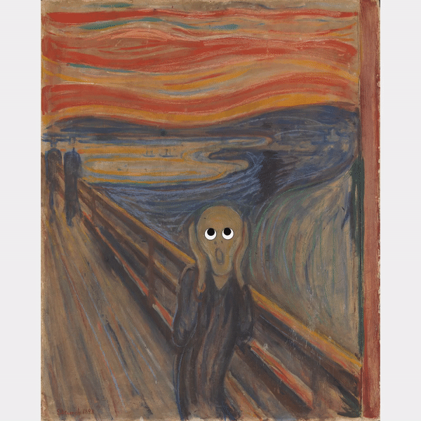
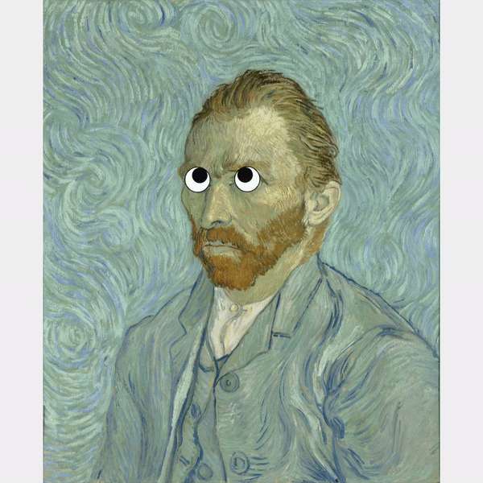

# Duchampesque art

## Or how I asked myself: If he could, why can't I?

## What are you onto?

Marcel Duchamp (1887-1968) was a French arist, mostly known for his fundamental contribute to the new *conceptual art*, whom he created. He was the leader of the *ready-made* art movement, where normal objects (ant not what before him was considered art) were taken out of their environment, modified and exposed in museums.

In my opinion that's a very controversial artistic style, because it's often seen as something *cheap* and not really interesting.

However, Duchamp is remembered as a very prolific artist. One of his most famous works is *L.H.O.O.Q.* (often known as *The Mona Lisa with mustaches*), a photo of Mona Lisa with mustaches on her *enigmatic* face.

## My (weekly) obsession

[As I have mentioned before](https://github.com/lorossi/bauhaus-time), I life my life one obsession at the time.

The most recent one is *googly eyes*. They are so funny, they make everything stupid and ridicule. Due to my childish sense of humor, I cannot stop laughing when I stick one to something.

I bought a 700-pack of them and I always keep them in my pockets, ready to be stuck somewhere in hope to make someone else laugh.

I hear you asking *why are you telling me this?*

Well, my dear imaginary reader, click the link and find out by yourself. Or scroll and see below some low quality rendered gifs. Or check my [Instagram profile](https://instagram.com/lorossi), where you can also find some of my other projects.

## Try it here [lorenzoros.si/duchampesque-art](https://lorenzoros.si/duchampesque-art)

## I explained the why, but how?

This whole page works thanks to the canvas element. I draw over it using Javascript, without using any external library (except for the boilerplate that I made for my own projects and you can get [here](https://github.com/lorossi/empty-html5-canvas-project)).

I hardcoded the position of the eyes in the script that loads the image. Later on, the *real* position of the eyes (the one accounting for canvas margin and image resizing) is calculated and the eyes are stitched over the painting. This gives me a lof of flexibility: **if I want to add a new painting, I just need to download the image, measure the position and the radius of each eye and update a few lines of script.**. It's as easy as that.

When the mouse is moved, the script updates and calculates the angle between the center of the eyes and the mouse position (relative to the canvas itself). Then the eyes are rotated and displayed as such in the next frame.

## Output

## Credits

This project is distributed under Attribution 4.0 International (CC BY 4.0) license.
